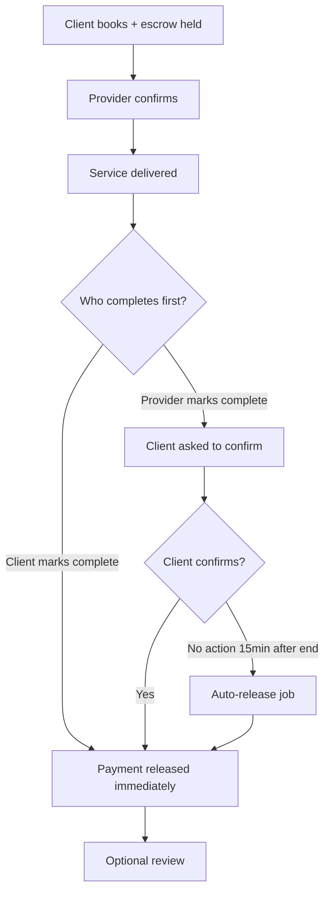

# Proxideck — Dispute & Resolution SOP

**Version:** Draft 1  
**Date:** May 2026  
**Owner:** Operations / Support (admin)  
**Audience:** Admin team, support, leadership  

**Related docs:** [PRODUCT_THESIS.md](./PRODUCT_THESIS.md) · [FIX_PLAN.md](./FIX_PLAN.md) · [DEMO_SCRIPT.md](./DEMO_SCRIPT.md) · `WALLET_ESCROW_IMPLEMENTATION.md`

---

## Purpose

Define how Proxideck **resolves customer issues responsibly** after a booking — who decides, what the platform does automatically, when humans intervene, and how money moves.

This SOP answers the CTO question: *“When something goes wrong, who gets the money — and who is accountable?”*

---

## Principles

1. **Escrow first** — Client funds stay held until completion is confirmed or a refund rule applies.  
2. **Automate the common cases** — Cancellations and normal completion should not require admin.  
3. **Human judgment for disputes** — Reports and quality failures need a person, a decision, and an audit trail.  
4. **Both sides informed** — Every resolution ends with notification to client and provider (email today; WhatsApp planned).  
5. **Document everything** — Admin notes on reports/support tickets; wallet adjustments require a reason.

---

## Roles

| Role | Responsibility |
|------|----------------|
| **Client** | Book, pay (wallet/escrow), confirm completion or report issue, leave review |
| **Provider** | Confirm/cancel/complete job, report client misconduct |
| **Platform (automated)** | Escrow hold/release/refund per rules; auto-cancel unconfirmed bookings; auto-release after grace period |
| **Admin / Support** | Triage reports & support tickets, decide outcomes, adjust wallets if needed, suspend users, close loop |

**Admin entry points (today):**

- `/admin/moderation/reports` — appointment reports  
- `/admin/support` — general support requests  
- `/admin/users/{id}` — wallet adjustment, suspend  
- `/admin/financial` — platform revenue overview  

---

## Money flow reference

### Escrow states (`appointments.escrow_status`)

| Status | Meaning |
|--------|---------|
| `held` | Client paid; funds locked for this appointment |
| `released` | Paid out to provider (minus platform fee) |
| `refunded` | Returned to client wallet |
| `forfeited` | Partial penalty retained (late client cancel) |

### Platform fee on release

- Default **10%** commission on gross escrow amount (`config/fees.booking_fee_percent`)  
- **0%** if provider has an **active subscription** and billing model is subscription  
- Provider receives `provider_payout_amount`; fee stored on appointment record  

### Automated rules (no admin required)

| Event | Who triggers | Money outcome | Code reference |
|-------|--------------|---------------|----------------|
| **Client cancels early** (>12h before start) | Client | Full refund to client wallet | `AppointmentController::cancelSingleAppointment` |
| **Client cancels late** (<12h before start) | Client | **10%** penalty to provider; remainder refunded | Same; `LATE_CANCELLATION_PENALTY_PERCENT = 10` |
| **Provider cancels** | Provider | Full refund to client | `ScheduleController::cancelAppointment` |
| **Provider never confirms** (system) | Job ~1h before start | Full refund; client notified with alternatives | `AutoCancelUnconfirmedAppointmentJob` |
| **Client confirms complete** | Client | Immediate release to provider (minus fee) | `AppointmentController::complete` → `releaseHeldPayment` |
| **Provider marks complete, client silent** | Job 15min after `end_time` | Auto-release to provider | `CreditCompletedAppointmentDeplay` |
| **Provider marks complete, client disputes** | Client report | Escrow may already be held or released — see dispute workflow | Manual admin |

> **Note:** `WALLET_ESCROW_IMPLEMENTATION.md` mentions a 5-hour cutoff; **live code uses 12 hours** (`APPOINTMENT_CHANGE_CUTOFF_HOURS`). This SOP follows the code.

---

## Normal completion loop (happy path)

Use this in demos — it is the default, non-dispute flow.

**Support action:** None unless a party contacts support.

---

## Issue intake channels

| Channel | When used | Admin location |
|---------|-----------|----------------|
| **Report on appointment** | Client or provider flags a specific booking | `/admin/moderation/reports` |
| **Support request** | General help, billing, account | `/admin/support` |
| **Contact form** | Pre-login inquiries | May create support ticket |

### Report fields (appointment-linked)

- `reason` (required)  
- `description` (optional detail)  
- Linked `appointment_id`, `user_id` (reporter)  
- Resolution: `action_taken`, `penalty_applied`, `resolved_at`  

**Important:** Resolving a report in admin **does not automatically move escrow**. Admin must align appointment status + wallet with the decision (see below).

---

## SLA targets (operational)

| Priority | Examples | First response | Resolution target |
|----------|----------|----------------|-------------------|
| **P1 — Money stuck** | Escrow held after cancelled job; wrongful charge | 4 business hours | 24 business hours |
| **P2 — Service dispute** | Job not done, quality issue, no-show | 1 business day | 3 business days |
| **P3 — Account / moderation** | Harassment, fraud suspicion, fake profile | 1 business day | 5 business days |

Adjust as team capacity grows. Publish support hours on Contact page.

---

## Dispute decision matrix

Use after reviewing appointment timeline, messages (future), wallet transactions, and both parties’ statements.

| Scenario | Typical outcome | Escrow action | Admin follow-up |
|----------|-----------------|----------------|-----------------|
| **Provider no-show** (client waited, provider didn’t arrive) | Full refund | Refund if still `held`; claw back from provider if already `released` | Warn/suspend provider; resolve report |
| **Client no-show** (provider arrived) | Provider paid per policy | Release to provider (or partial if policy added) | Document; optional client warning |
| **Work incomplete / poor quality** | Partial refund OR full refund | Refund % to client; remainder to provider if fair | Mediate once; second offense → suspend |
| **Scope disagreement** (price/work not as agreed) | Case-by-case | Hold until agreed; split or full refund | Encourage written scope in booking notes |
| **Client false dispute** (work was fine) | Pay provider | Release if held | Warn client |
| **Provider cancels last minute** | Full refund (automatic) | Already refunded by system | Track repeat cancels |
| **Payment released but client disputes after** | Case-by-case | `refundUpfrontPayment` from provider wallet if balance allows | Admin wallet tools |
| **Both parties unresponsive** | Follow auto-release rules | Job handles after end_time + 15min | Only if escrow abnormally stuck |

**Default bias:** If service clearly did not happen and escrow is `held`, **refund the client**. If service clearly happened and client refuses to confirm, **release to provider** after grace period (already automated).

---

## Step-by-step: Report triage workflow

### 1. Receive & assign

1. Open `/admin/moderation/reports?status=unresolved`  
2. Assign owner (support/admin name in external tracker if used)  
3. Note appointment ID, parties, escrow status, amount  

### 2. Investigate (checklist)

- [ ] Appointment status, start/end times, `cancelled_by`  
- [ ] `escrow_status`, `escrow_amount`, `payment_released_at`  
- [ ] Wallet transactions for client + provider (`wallet_transactions` for appointment)  
- [ ] Cancellation reason (if any)  
- [ ] Service address vs provider address (on-site vs in-shop)  
- [ ] Prior reports/reviews for same user  
- [ ] Provider verification status  

### 3. Contact parties (if needed)

- Email both client and provider from support@proxideck.com (or configured address)  
- Ask for: what was agreed, photos (on-site jobs), time arrived, work done  
- Set 48h response deadline for P2 disputes  

### 4. Decide & execute money movement

**If escrow still `held`:**

| Decision | Action |
|----------|--------|
| Full refund client | Cancel appointment if not already; ensure `refundEscrow` ran (or admin wallet correction) |
| Pay provider | Mark completed; run release path or manual provider credit |
| Split | Refund X to client, release Y to provider — **requires admin wallet adjustment today** (no split UI yet) |

**If escrow already `released`:**

- Use `/admin/users/{client}` and `/admin/users/{provider}` → **Update wallet** with documented reason  
- Prefer debiting provider and crediting client for wrongful release  
- If provider wallet insufficient, flag for finance follow-up  

**Admin wallet adjustment rules:**

- Always fill **reason** field (appears in transaction metadata)  
- Record report ID / appointment ID in reason  
- Double-check `escrow_balance ≤ balance`  
- Two-person review for adjustments **> ₦50,000** (recommended policy)

### 5. Resolve report in admin

1. `/admin/moderation/reports` → Resolve  
2. Fill **action_taken** (plain English summary for audit)  
3. Optional **penalty_applied**: `warning` | `suspend` | `ban`  
4. Set `resolved_at` (automatic on submit)  

**Known gap:** `penalty_applied: suspend` currently clears `email_verified_at` only — not a true ban. Track manual suspension in admin notes until `suspended_at` exists (see FIX_PLAN backlog).

### 6. Close the loop

- Notify client: outcome + wallet balance impact  
- Notify provider: outcome + any penalty  
- Mark related support ticket resolved if exists  
- Client may still leave/update review separately  

---

## Step-by-step: Support ticket workflow

For non-appointment issues (wallet top-up failed, can’t log in, provider verification):

1. `/admin/support` → filter open tickets  
2. Investigate; link to user/appointment if applicable  
3. Resolve with **admin_notes** (visible internally; user gets `SupportRequestResolvedNotification`)  
4. If money involved, follow wallet adjustment process above  

---

## Cancellation quick reference (client-facing copy)

Share with support for consistent answers:

| Situation | Client gets |
|-----------|-------------|
| Cancel **more than 12 hours** before start | **100%** refund to wallet |
| Cancel **less than 12 hours** before start | **10%** fee; **90%** refunded |
| Provider cancels | **100%** refund |
| Provider didn’t confirm in time | **100%** refund (automatic) |

Provider-configured cancellation penalty in Advanced Settings may exist in UI; **client late-cancel uses platform 10% constant** in current code — align messaging with code until unified.

---

## Completion & auto-release quick reference

| Step | What happens |
|------|----------------|
| Provider marks job complete | Client emailed to confirm (`AwaitingClientConfirmation`) |
| Client confirms | Payment released immediately |
| Client does nothing | **15 minutes after appointment end time**, system auto-releases if escrow still held |
| Client marks complete first | Payment released immediately; provider side updated |

Support should **not** manually release unless auto-job failed — check queue/cron for `CreditCompletedAppointmentDeplay`.

---

## Escalation

| Condition | Escalate to |
|-----------|-------------|
| Adjustment > ₦50,000 | Finance lead + second admin approval |
| Fraud / stolen account | Leadership; preserve logs; suspend both parties pending review |
| Legal threat | Leadership + legal counsel |
| Repeated same provider complaints | Verification team; consider delisting |
| Bug suspected (double charge, escrow mismatch) | Engineering with appointment ID + transaction IDs |

---

## Product gaps to close (engineering)

These improve this SOP but are not blockers for manual ops today:

| Gap | Impact | Fix plan |
|-----|--------|----------|
| Report resolve doesn’t trigger escrow actions | Admin must manually adjust wallets | P1.6 + future admin “Apply refund” action |
| No true `suspended_at` on users | Suspend is weak | User management migration |
| No partial refund UI | Split decisions are manual | Wallet admin tooling |
| `WALLET_ESCROW_IMPLEMENTATION.md` says 5h cutoff | Doc drift | Update root doc to 12h |
| No in-app dispute status for client | Support load | Client booking detail “Dispute under review” state |
| WhatsApp notifications | Slow loop in Nigeria | P2.1 |

---

## Audit & compliance

- All wallet movements should have `wallet_transactions` rows  
- Admin adjustments include `metadata.admin_id` and reason  
- Keep report `action_taken` permanent — do not delete resolved reports  
- Reviews moderation: `/admin/moderation/reviews` — delete only spam/abuse  

---

## Demo script (dispute path — 60 seconds)

For leadership demos when asked *“what if it goes wrong?”*:

1. Show booking with escrow **held**  
2. Open client booking → **Report issue**  
3. Show admin report queue → investigate appointment + escrow  
4. Explain decision: *“Refund client because provider no-show”*  
5. Show wallet refund + resolved report + notifications  

Do **not** claim one-click refund from report screen until built — say *“admin completes resolution; product will automate common cases next.”*

---

## Revision history

| Version | Date | Changes |
|---------|------|---------|
| Draft 1 | May 2026 | Initial SOP from live escrow/report/admin behavior |
